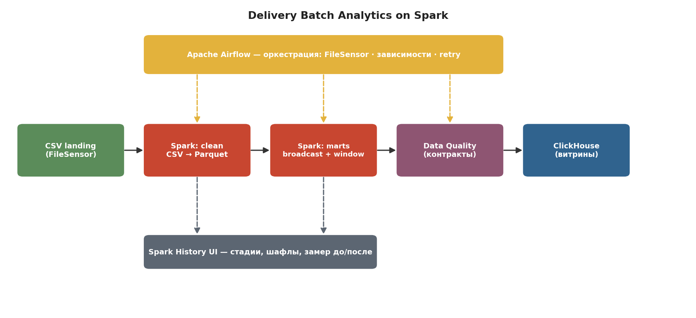
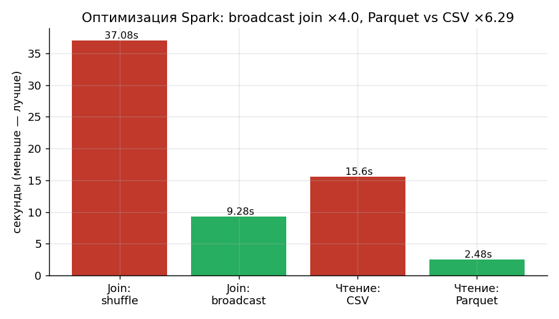
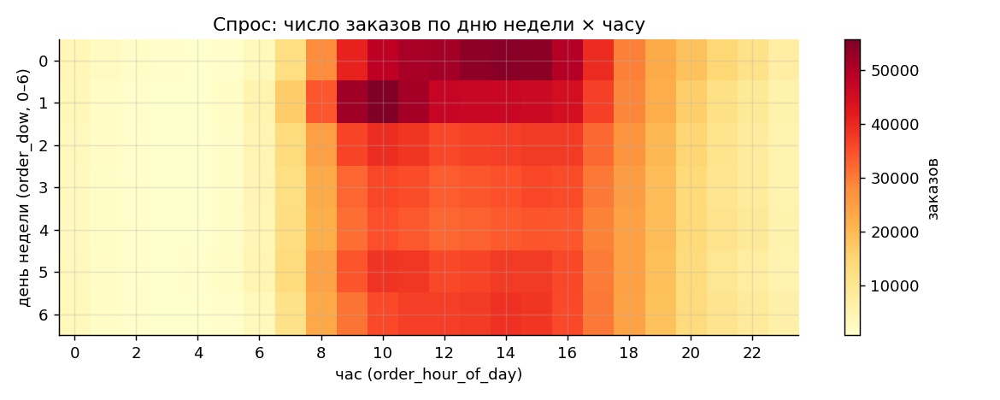
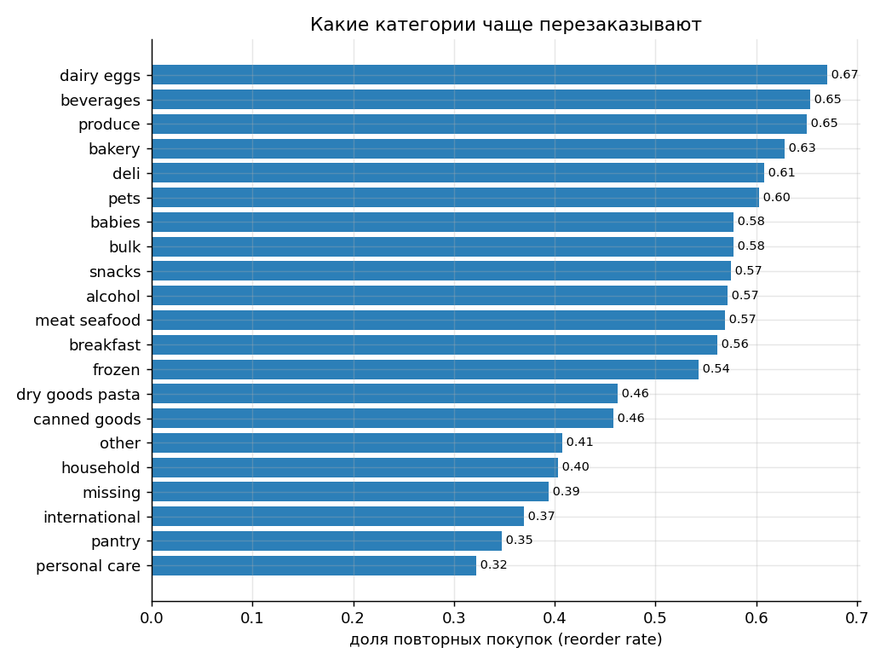

# Delivery Batch Analytics on Spark

Батч-обработка большого датасета на **PySpark** с оркестрацией в Airflow и
записью витрин в ClickHouse. Фокус — тяжёлый распределённый батч и
**оптимизация Spark** на реальном открытом датасете.

Сделано как самостоятельная data-инженерная часть к тестовому заданию ecom-tech.
Отдельный проект про потоковую обработку (другой датасет, другой стек) —
[darkstore-delivery-analytics](https://github.com/EternalSol1tude/darkstore-delivery-analytics).

**Стек:** PySpark · Airflow (FileSensor) · ClickHouse · Docker Compose.

---

## Данные

[Instacart Market Basket Analysis](https://www.kaggle.com/datasets/psparks/instacart-market-basket-analysis)
— реальный открытый датасет продуктовой доставки: **~3.4M заказов и ~32M
позиций** в корзинах. Тематически близок к darkstore (продуктовый ритейл),
достаточно большой, чтобы оптимизации Spark давали измеримый эффект.

Датасет в репозиторий не кладётся (~700 МБ) — скачивается отдельно и
распаковывается в `data/raw/` (6 CSV: `orders`, `order_products__prior/train`,
`products`, `aisles`, `departments`).

> Датасет анонимизирован и без абсолютных дат (есть только день недели, час и
> «дней с прошлого заказа»), поэтому аналитика построена вокруг корзины и
> поведения клиентов, а не времени доставки.

## Архитектура



Spark работает в `local[*]` прямо внутри задачи Airflow (pyspark + JDK в образе) —
для десятков млн строк отдельный кластер не нужен, а DataFrame API, оптимизации и
Spark UI задействованы полностью.

## Витрины

| Витрина | Содержание | Что демонстрирует |
|---------|-----------|-------------------|
| `mart_department_kpis` | объём, reorder-rate, средняя корзина по департаментам | broadcast join 32M × справочники |
| `mart_aisle_reorder` | reorder-rate по полкам + детект аномалий (z-score) | агрегации + простая статистика |
| `mart_product_rank` | топ-10 товаров внутри департамента | **оконная функция** `row_number()` |
| `mart_hourly_demand` | заказы по дню недели × часу + средняя корзина | join + агрегации |
| `mart_user_cohort` | поведение по «зрелости» клиента (номер заказа) | когортный анализ |

## Результаты

### Оптимизация Spark (главная метрика проекта)

Джоба [benchmark_join.py](spark/jobs/benchmark_join.py) честно замеряет «до/после»
на **33.8M строк** (сток `write.format("noop")` форсирует выполнение плана):



- **broadcast join — ×3.7 относительно shuffle join.** Один и тот же join
  `order_products` (32M) × `products`: в базовом варианте обе таблицы
  перемешиваются по ключу (sort-merge/shuffle), в оптимизированном маленький
  справочник рассылается на воркеры (broadcast) и большая таблица не шафлится:
  11.2s → 3.0s.
- **Parquet вместо CSV — ×2.6.** Одна и та же агрегация, читаемая из исходных
  CSV против предварительно сконвертированного Parquet (колоночный формат,
  сжатие, без парсинга строк): 8.0s → 3.0s.
- **Обнаружение перекоса (skew).** Замерил распределение ключа `product_id`:
  у самого частого товара **491 291** строк против медианы **63** (×7798) —
  поэтому группировки и джойны по этому ключу нагружают партиции неравномерно.

### Аналитика по данным





Примеры из витрин (реальный прогон):

| Департамент | Позиций | Reorder rate |
|-------------|--------:|-------------:|
| dairy eggs | 5 631 067 | 0.670 |
| beverages | 2 804 175 | 0.654 |
| produce | 9 888 378 | 0.650 |

Топ-товары в `produce` (оконная функция `row_number()`): Banana (491 291),
Bag of Organic Bananas (394 930), Organic Strawberries (275 577). Детект аномалий
по reorder-rate пометил 5 полок-выбросов.

Графики воспроизводимы: `python scripts/make_charts.py`.

## Запуск

Нужен Docker Desktop (≥ 6 ГБ RAM выделить) и скачанный датасет в `data/raw/`.

```bash
cp .env.example .env
docker compose up -d --build
```

| Сервис | URL | Логин |
|--------|-----|-------|
| Airflow | http://localhost:8081 | admin / admin |
| Spark History UI | http://localhost:18080 | — |
| ClickHouse | http://localhost:8124 | default / (пусто) |

Включить DAG `instacart_batch` в Airflow, затем «привезти батч» — создать
файл-маркер, которого ждёт **FileSensor**:

```bash
bash scripts/trigger_batch.sh      # создаёт data/landing/READY
```

Пайплайн отработает: `clean → marts → dq → load_clickhouse` (+ `benchmark`).
Результат — витрины в ClickHouse (`analytics.*`) и метрики в `data/metrics/benchmark.json`.

## Структура репозитория

```
spark/jobs/       clean_to_parquet, marts (broadcast+window), benchmark_join, dq_checks
airflow/dags/     instacart_batch (FileSensor → spark → dq → load), ch_load
clickhouse/init/  DDL витрин
scripts/          trigger_batch, make_charts, make_architecture
data/raw/         сюда распаковать датасет (в репо не хранится)
docs/             схема и графики результатов
docker-compose.yml
```

## Остановка

```bash
docker compose stop      # остановить
docker compose down -v   # удалить контейнеры и данные
```
